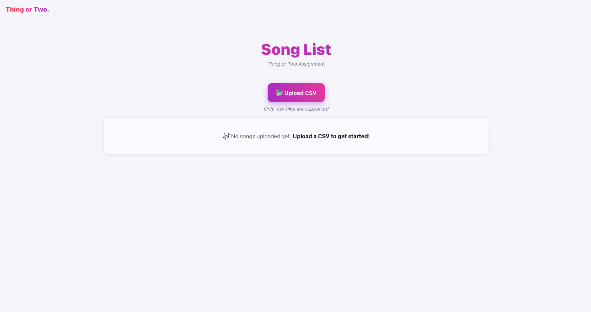
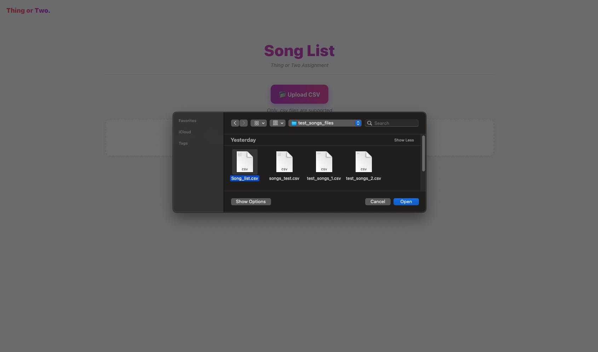
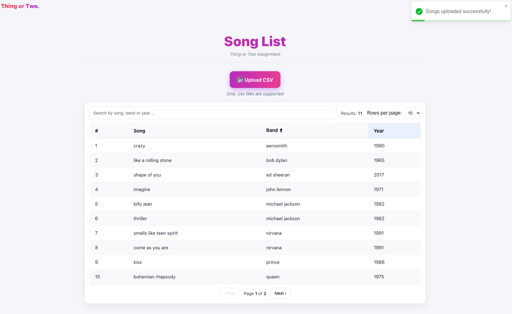
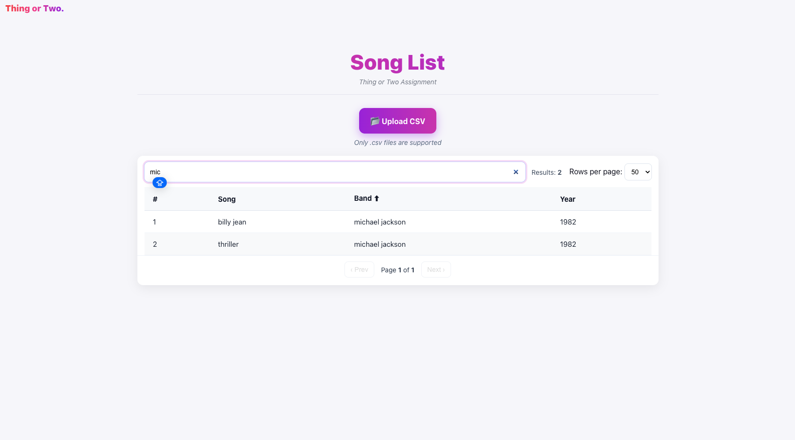

# 🎵 Thing or Two — Song List (Full-Stack Assignment)

A small full-stack app that uploads a CSV of songs, normalizes the data, stores it in PostgreSQL, and shows it in a clean React table.

- **Backend:** NestJS + TypeORM + PostgreSQL  
- **Frontend:** React (Vite) + TypeScript  
- **Infra:** Docker & Docker Compose

---

## Table of Contents
1. [Features](#features)
2. [Tech Stack](#tech-stack)
3. [Project Structure](#project-structure)
4. [Quick Start](#-quick-start)
5. [API](#api)
6. [CSV Format](#csv-format)
7. [Frontend UI](#frontend-ui)
8. [Local Development (without Docker)](#local-development-without-docker)
9. [Configuration](#configuration)
10. [Troubleshooting](#troubleshooting)
11. [What Was Evaluated](#what-was-evaluated)
12. [Author](#author)

---

## Features

### ✅ Core (per the assignment)
- **CSV Upload** — Upload a `.csv` file of songs.
- **Normalization** — Transform `name`, `band`, `year` to lowercase / parsed year.
- **Storage** — Save into a **SQL** DB (PostgreSQL here) via TypeORM.
- **Display** — **Simple table ordered by *Band* name**.

### ✨ Extras (nice-to-have, beyond the brief)
- Client‑side search (by song/band/year)
- Results count
- Client‑side pagination (10 / 25 / 50)
- Loading spinner and basic error toasts

> The extras are optional and meant to make review easier. The app fully satisfies the core scope even without them.

---

## Tech Stack
- **Backend:** NestJS, TypeORM, PostgreSQL  
- **Frontend:** React, Vite, TypeScript  
- **Infra:** Docker, Docker Compose

---

## 📂 Project Structure
```
thing02-songlist/
│── backend/        # NestJS backend
│   ├── src/
│   │   ├── songs/  # Songs module (entity, service, controller)
│   │   └── app.module.ts
│   └── Dockerfile
│
│── frontend/       # React + Vite frontend
│   ├── src/
│   │   ├── components/   # UI components (UploadButton, SongsTable)
│   │   ├── types/        # TypeScript interfaces
│   │   └── App.tsx
│   └── Dockerfile
│
│── docker-compose.yml    # Orchestrates backend + DB
│── README.md             # Project documentation
```

---

## 📦 Quick Start

### 1) Start DB + Backend (Docker only)
From the repository root:
```bash
docker compose up --build
```
- API base URL: `http://localhost:3000`
- Health check (songs): `http://localhost:3000/api/songs`

> You can also upload a CSV via API directly (see **API** section).

### 2) Start the Frontend (single local command)
From a second terminal:
```bash
cd frontend
npm ci
npm run dev
```
- UI URL: `http://localhost:5173`

> **Why split?** The brief requires running without a local DB (Docker for DB + API). Keeping the frontend as a lightweight Vite dev server makes review fast and avoids extra Docker setup not required by the test.

---

## API

**Base URL:** `http://localhost:3000`

| Method | Endpoint            | Description                         |
|-------:|---------------------|-------------------------------------|
| GET    | `/api/songs`        | List all songs **ordered by band**  |
| POST   | `/api/songs/upload` | Upload a CSV (multipart/form-data)  |

**Examples:**
```bash
# Upload
curl -F "file=@Song_list.csv" http://localhost:3000/api/songs/upload
# → { "ok": true, "total": 11 }

# List
curl http://localhost:3000/api/songs
# → [{ "id":1, "name":"crazy", "band":"aerosmith", "year":1990 }, ...]
```

---

## CSV Format

- **Headers (flexible):** supports either
  - `name, band, year`
  - or `Song Name, Band, Year`
- **Delimiters:** comma `,` or semicolon `;`

**Examples:**
```csv
name,band,year
crazy,aerosmith,1990
imagine,john lennon,1971
```

```csv
Song Name;Band;Year
like a rolling stone;bob dylan;1965
thriller;michael jackson;1982
```

---

## Frontend UI
- **Simple table ordered by Band** (meets core requirement)
- Optional: search, results count, pagination (10/25/50), loading states

---

---

## Screenshots
- **First screen Empty Table:**  
  
- **Upload & Table (ordered by Band):**  
  
  
  
- **Search & Pagination (extra):**  
  

---

## Local Development (without Docker)

In one terminal (backend):
```bash
cd backend
npm install
npm run start:dev
# API on http://localhost:3000
```

In another terminal (frontend):
```bash
cd frontend
npm install
npm run dev
# App on http://localhost:5173
```

You’ll need a local PostgreSQL instance and environment variables set (see **Configuration**).

---

## Configuration

Docker (root `.env`)
Create a `.env` file in the **project root** (next to `docker-compose.yml`). Docker Compose
loads it automatically and injects variables to the `db` and `backend` services.

```env
# --- Postgres (service: db) ---
POSTGRES_USER=postgres
POSTGRES_PASSWORD=postgres
POSTGRES_DB=songsdb

# --- Backend DB config ---
DB_HOST=songsdb
DB_PORT=5432
DB_USER=postgres
DB_PASSWORD=postgres
DB_NAME=songsdb

# --- CORS (Frontend) ---
CORS_ORIGIN=http://localhost:5173
```

---

## Troubleshooting

1) **API starts before Postgres is ready**  
   Nest retries automatically. If needed:
   ```bash
   docker compose restart backend
   ```

2) **Changed schema and now sync fails**  
   Drop the table and let TypeORM recreate it:
   ```bash
   docker exec -it songsdb psql -U postgres -d songsdb -c 'DROP TABLE IF EXISTS songs CASCADE;'
   docker compose restart backend
   ```

3) **CSV upload returns 400**  
   - Ensure headers are present (`name/band/year` or `Song Name/Band/Year`)  
   - `year` must be numeric  
   - File must be `.csv` (comma or semicolon delimited)

---

## What Was Evaluated

### ✅ According to the brief
- Clean code & project structure (NestJS modules, React components)
- Error handling (try/catch, helpful messages)
- Type safety (TypeScript across backend & frontend)
- **Runs without a local DB** (Docker & Docker Compose)
- **Displays data in a simple table ordered by Band**

### ✨ Extras implemented (optional, beyond scope)
- Client‑side search & results count
- Client‑side pagination (10/25/50)
- Loading & basic error toasts

> These extras are clearly optional and do not change the core scope. They’re included to improve UX.

---

## Author

**Raphael Benoliel**  
📧 [raphael2gb@gmail.com](mailto:raphael2gb@gmail.com)
